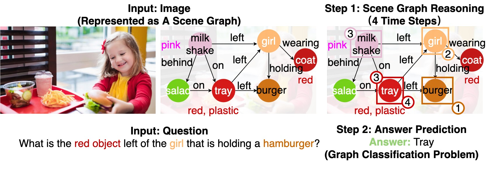
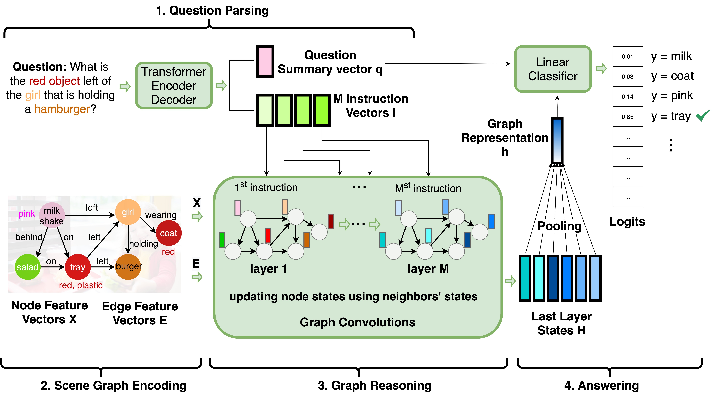
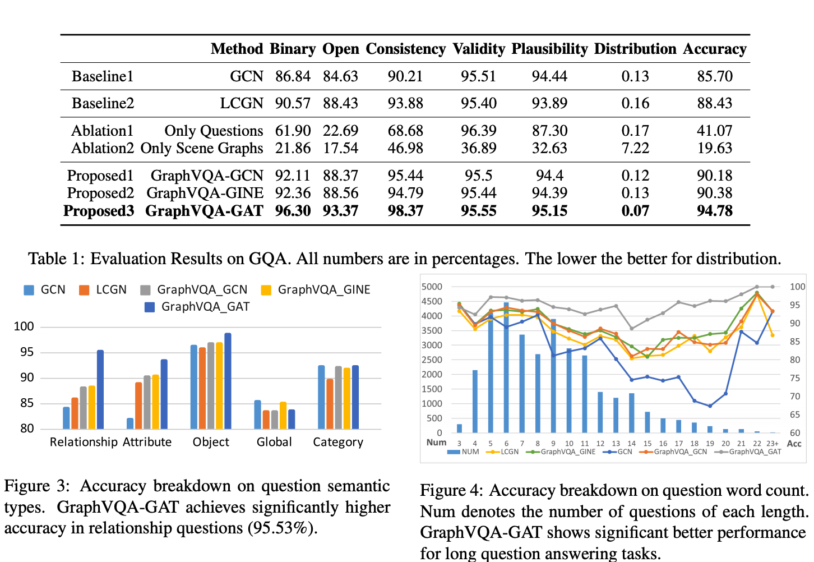

# GraphVQA: Language-Guided Graph Neural Networks for Scene Graph Question Answering

[](https://paperswithcode.com/sota/graph-question-answering-on-gqa?p=graghvqa-language-guided-graph-neural)
[](https://github.com/codexxxl/GraphVQA/blob/master/LICENSE)


This repo provides the source code of our paper: [GraphVQA: Language-Guided Graph Neural Networks for Scene Graph Question Answering](https://www.aclweb.org/anthology/2021.maiworkshop-1.12/) (NAACL 2021 MAI Workshop) [[PDF]](https://arxiv.org/pdf/2104.10283.pdf).
```
@inproceedings{2021graphvqa,
  author    = {Weixin Liang and
               Yanhao Jiang and
               Zixuan Liu},
  title     = {{GraghVQA}: Language-Guided Graph Neural Networks for Graph-based Visual
               Question Answering},
    booktitle = "Proceedings of the Third Workshop on Multimodal Artificial Intelligence",
    month = jun,
    year = "2021",
    address = "Mexico City, Mexico",
    publisher = "Association for Computational Linguistics",
    url = "https://www.aclweb.org/anthology/2021.maiworkshop-1.12",
    doi = "10.18653/v1/2021.maiworkshop-1.12",
    pages = "79--86"
}
```


## Related Paper
[LRTA: A Transparent Neural-Symbolic Reasoning Framework with Modular Supervision for Visual Question Answering](https://www.amazon.science/publications/lrta-a-transparent-neural-symbolic-reasoning-framework-with-modular-supervision-for-visual-question-answering) (NeurIPS KR2ML 2020). 
Weixin Liang, Feiyang Niu, Aishwarya Reganti, Govind Thattai and Gokhan Tur. 
[[PDF]](https://arxiv.org/abs/2011.10731)
[[Lightning Talk]](https://slideslive.com/38941483/lrta-a-transparent-neuralsymbolic-reasoning-framework-with-modular-supervision-for-visual-question-answering)
[[Blog]](https://www.amazon.science/publications/lrta-a-transparent-neural-symbolic-reasoning-framework-with-modular-supervision-for-visual-question-answering)
[[Github]](https://github.com/Aishwarya-NR/LRTA_Perturbed_Dataset)
[[Poster]](https://kr2ml.github.io/2020/papers/KR2ML_2_poster.pdf)
[[NeurIPS KR2ML 2020]](https://kr2ml.github.io/2020/papers/)


## Abstract
*Images are more than a collection of objects or attributes --- they represent a web of relationships among interconnected objects. Scene Graph has emerged as a new modality for a structured graphical representation of images. Scene Graph encodes objects as nodes connected via pairwise relations as edges. To support question answering on scene graphs, we propose GraphVQA, a language-guided graph neural network framework that translates and executes a natural language question as multiple iterations of message passing among graph nodes. We explore the design space of GraphVQA framework, and discuss the trade-off of different design choices. Our experiments on GQA dataset show that GraphVQA outperforms the state-of-the-art model by a large margin (88.43% vs. 94.78%). 
Our code is available at https://github.com/codexxxl/GraphVQA*


<p align="center">
  
</p>
<p align="center">
  
</p>

<p align="center">
  
</p>


## Usage
### 0. Dependencies

Create a `conda` environment with `python` version = 3.6

#### 0.1. Install torchtext, spacy
Run following commands in the created `conda` environment
(Note: torchtext requires version: torchtext<0.9.0)
```
conda install -c pytorch torchtext
conda install -c conda-forge spacy
conda install -c conda-forge cupy
python -m spacy download en_core_web_sm
conda install -c anaconda nltk
```

Excute `python` and run following:
```
import nltk
nltk.download('wordnet')
```

#### 0.2. Install PyTorch Geometric
Follow the link below to install PyTorch Geometric via binaries: 
https://pytorch-geometric.readthedocs.io/en/latest/notes/installation.html#installation-via-binaries

Example installation commands with `PyTorch 1.4.0` and `CUDA 10.0`: (Note you need to replace `torch-1.4.0+cu100` field with your own installed `PyTorch` and `CUDA` versions.)
```
pip install --no-index torch-scatter -f https://pytorch-geometric.com/whl/torch-1.4.0+cu100.html
pip install --no-index torch-sparse -f https://pytorch-geometric.com/whl/torch-1.4.0+cu100.html
pip install --no-index torch-cluster -f https://pytorch-geometric.com/whl/torch-1.4.0+cu100.html
pip install --no-index torch-spline-conv -f https://pytorch-geometric.com/whl/torch-1.4.0+cu100.html
pip install torch-geometric
```


### 1. Download Data

Download scene graphs raw data from: 
https://nlp.stanford.edu/data/gqa/sceneGraphs.zip  
Download questions raw data from: 
https://nlp.stanford.edu/data/gqa/questions1.2.zip

Put sceneGraph json files: `train_sceneGraphs.json`, `val_sceneGraphs.json` into `sceneGraphs/`

Put questions json files: `train_balanced_questions.json`, `val_balanced_questions.json`, `test_balanced_questions.json`, `testdev_balanced_questions.json` into `questions/original/`

After this step, the data file structure should look like this:
```
GraphVQA
    questions/
        original/
            train_balanced_questions.json
            val_balanced_questions.json
            test_balanced_questions.json
            testdev_balanced_questions.json
    sceneGraphs/
        train_sceneGraphs.json
        val_sceneGraphs.json
```


### 2. Modify Root Directory
Replace `line 13` in `Constants.py` with your own root directory that contains this source code folder:  
```ROOT_DIR = pathlib.Path('/Users/yanhaojiang/Desktop/cs224w_final/')```

Note `ROOT_DIR` does not contain the repo name `GraphVQA`. E.g. for the `ROOT_DIR` above, my source code folder would be `/Users/yanhaojiang/Desktop/cs224w_final/GraphVQA `.


### 3. Preprocess Question Files (just need to run once)
Run command:
```
python preprocess.py
```

### 4. Test Installations and Data Preparations
Following commands should run without error:
```
python pipeline_model_gat.py 
python gqa_dataset_entry.py 
```


### 5. Training 

#### 5.1. Main Model: GraphVQA-GAT 
Single GPU training:  
```CUDA_VISIBLE_DEVICES=0 python mainExplain_gat.py --log-name debug.log --batch-size=200 --lr_drop=90```

Distributed training:  
```CUDA_VISIBLE_DEVICES=0,1,2,3 python -m torch.distributed.launch --nproc_per_node=4 --use_env mainExplain_gat.py --workers=4 --batch-size=200 --lr_drop=90```

To kill a distributed training:  
```kill $(ps aux | grep mainExplain_gat.py | grep -v grep | awk '{print $2}')```


#### 5.2. Baseline and Test Models
Baseline and other test models are trained in similar ways with corresponding `mainExplain_{lcgn, gcn, gine}.py` file excuted. Their related files are appended in `\baseline_and_test_models`. (Note move them out of this folder to train).  
Corresponding to GraphVQA-GAT's model and training files: `gat_skip.py`, `pipeline_model_gat.py`, and `mainExplain_gat.py`, those model files are:

1. Baseline LCGN: `lcgn.py`, `pipeline_model_lcgn.py`, `mainExplain_lcgn.py`
2. GraphVQA-GCN: `pipeline_model_gcn.py`, `mainExplain_gcn.py`
3. GraphVQA-GINE: `pipeline_model_gine.py`, `mainExplain_gine.py`


### 6. Evaluation

We re-organize the evaluation script provided by GQA official, the original script and evaluation data can be found at https://cs.stanford.edu/people/dorarad/gqa/evaluate.html
Step 1: Generate evaluation dataset
To evaluate your model, there are two options:
1. Use validation_balanced set of programs.
2. Use validation_all set provided by GQA official.

#### 6.1 Data Preparation
First download evaluation data from: https://nlp.stanford.edu/data/gqa/eval.zip.
then unzip the file and move val_all_question.json to `expainableGQA/questions/original/`
now we will have 
```
GraphVQA
    questions/
        original/
            val_all_questions.json
```
#### 6.2 Evaluation
Option 1: Since after running Step 3(preprocess.py), we already have 
```
GraphVQA
    questions/
        val_balanced_programs.json
```

then, run commands
```
CUDA_VISIBLE_DEVICES=0,1,2,3 python -m torch.distributed.launch --nproc_per_node=4 --use_env mainExplain_gat.py --workers=4 --batch-size=4000 --evaluate --resume=outputdir/your_checkpoint.pth --evaluate_sets='val_balanced --output_dir='./your_outputdir/' --evaluate_sets='val_unbiased'
```
you should get results json file located in './your_outputdir/dump_result.json'

then, run ```python eval.py --predictions=./your_outputdir/dump_results.json --consistency```


Option 2: If you want to use validation_all set, then, run commands 
```
python preprocess.py --val-all=True
```
we should get 
```
GraphVQA
    questions/
        val_all_programs.json
```

then, run commands
```
CUDA_VISIBLE_DEVICES=0,1,2,3 python -m torch.distributed.launch --nproc_per_node=4 --use_env mainExplain_gat.py --workers=4 --batch-size=4000 --evaluate --resume=outputdir/your_checkpoint.pth --evaluate_sets='val_balanced --output_dir='./your_outputdir/' --evaluate_sets='val_all'
```
you should get results json file located in './your_outputdir/dump_results.json'

then, run 
```
python eval.py --predictions=./your_outputdir/dump_results.json --consistency
```


  
